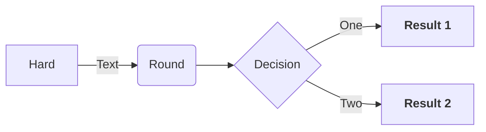
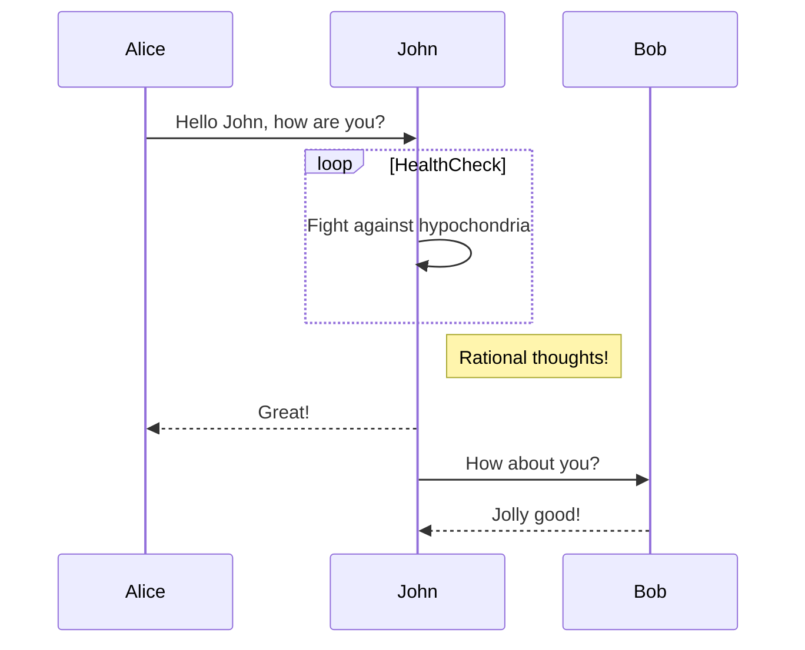
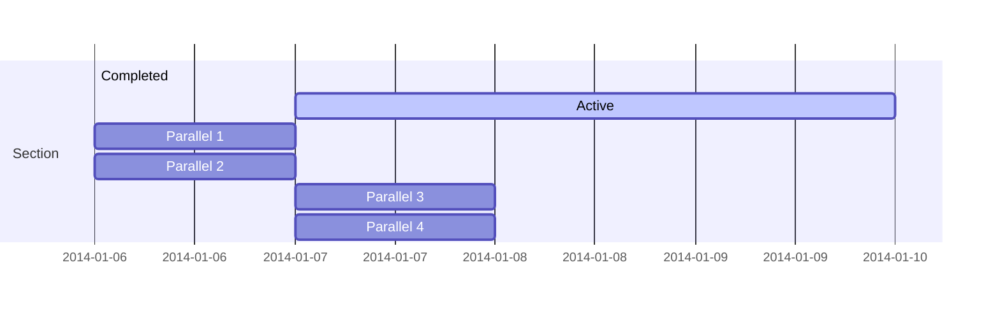
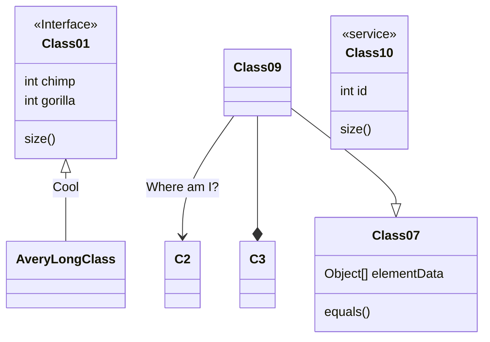
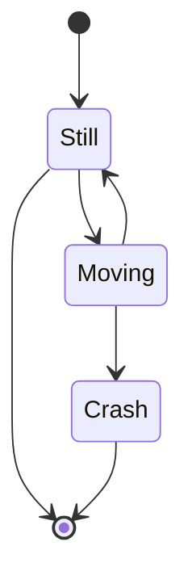
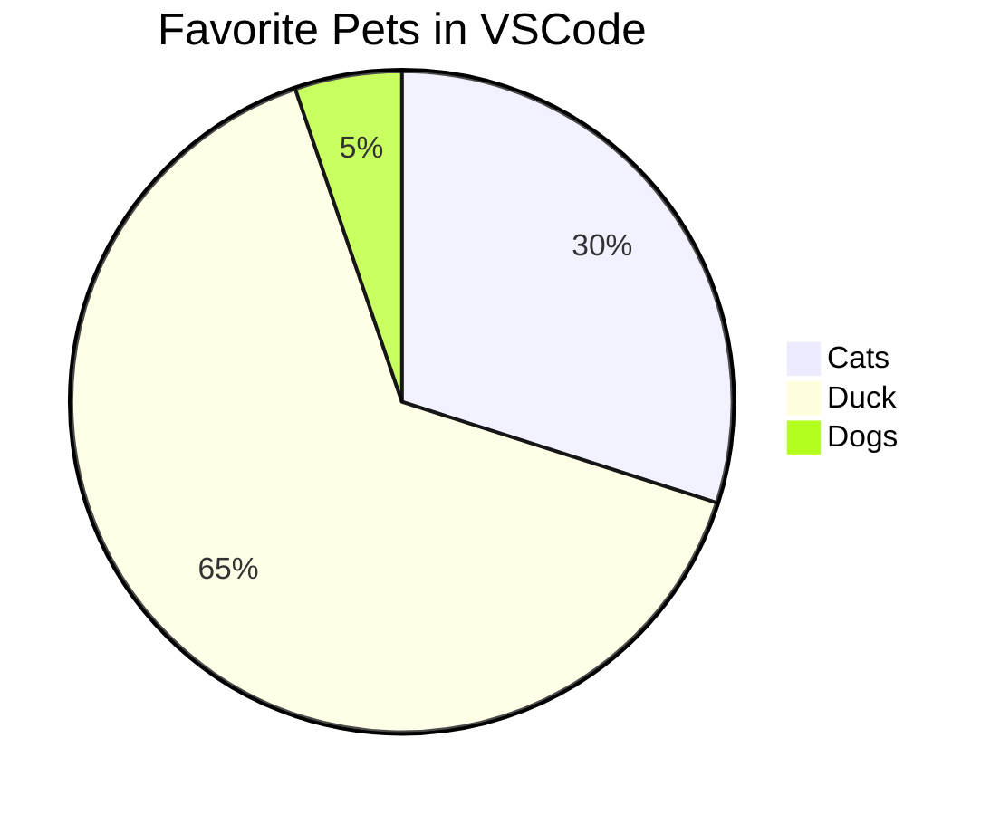
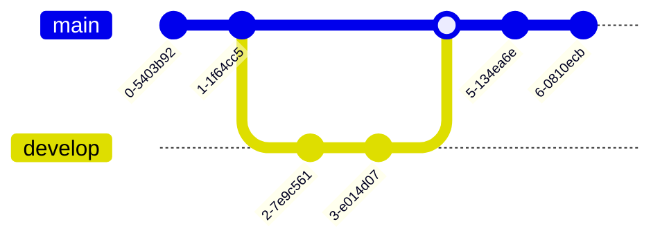
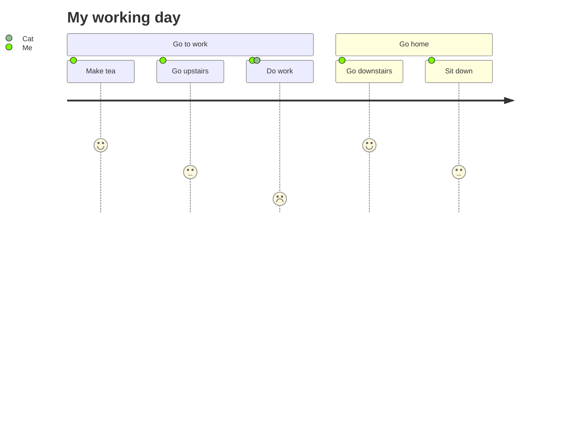
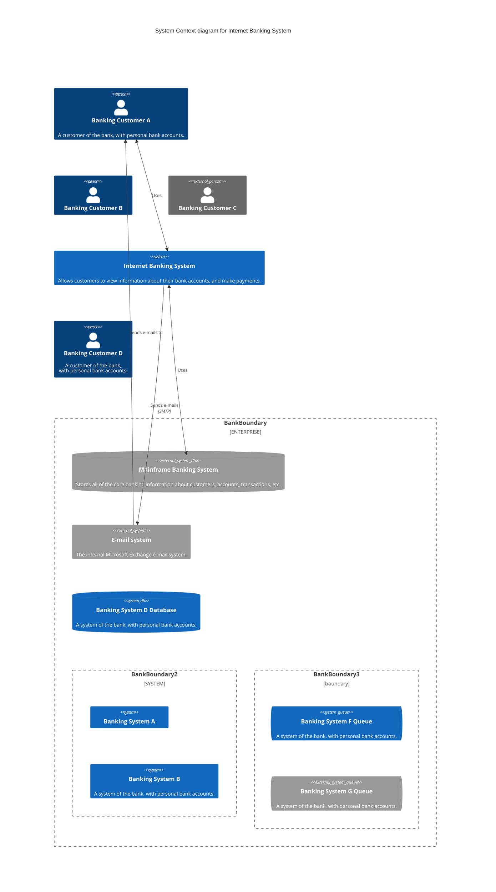

Here are several examples of how to create diagrams and charts using [Mermaid](https://mermaid.js.org/). These examples are based on the official documentation, where you can find more advanced details.

## Mermaid

### Flowchart



```
flowchart TD

A[Hard] -->|Text| B(Round)
B --> C{Decision}
C -->|One| D["`**Result 1**`"]
C -->|Two| E["`**Result 2**`"]
```

> Source: [https://mermaid.js.org/syntax/flowchart.html](https://mermaid.js.org/syntax/flowchart.html)

### Sequence Diagram



### Gantt Chart



### Class Diagram



```
classDiagram
Class01 <|-- AveryLongClass : Cool
<<Interface>> Class01
Class09 --> C2 : Where am I?
Class09 --* C3
Class09 --|> Class07
Class07 : equals()
Class07 : Object[] elementData
Class01 : size()
Class01 : int chimp
Class01 : int gorilla
class Class10 {
  <<service>>
  int id
  size()
}
```

> Source: [https://mermaid.js.org/syntax/classDiagram.html](https://mermaid.js.org/syntax/classDiagram.html)

### State Diagram



```
stateDiagram-v2
[*]     --> Still
Still   --> [*]
Still   --> Moving
Moving  --> Still
Moving  --> Crash
Crash   --> [*]
```

> Source: [https://mermaid.js.org/syntax/stateDiagram.html](https://mermaid.js.org/syntax/stateDiagram.html)

### Pie Chart



```
pie
title Favorite Pets in VSCode
"Cats" : 85.9
"Duck" : 186
"Dogs" : 15
```

> Source: [https://mermaid.js.org/syntax/pie.html](https://mermaid.js.org/syntax/pie.html)

### Git graph



```
gitGraph
  commit
  commit
  branch develop
  checkout develop
  commit
  commit
  checkout main
  merge develop
  commit
  commit
```

> Note: Git Graph is on experimental, [live editor](https://mermaid.live/edit#pako:eNptkktv2zAMx7-KodOK5WHLjuwIvQx9ADvs1FthoKAlxRZiSake7dIs332yW7tdO53EH_knKVInxAwXiCLWg3PXEloLqtZJPD-0VNAnl3-Wy-Q6sP1Xeitd95Xei8bCP5gm36X2CbTiM77zVuo2aYXmwn50DhL3C1S8frv45FDgxQTHtsf2Tq8gmZM2AvZXpjd2drhnqSZhNB8DsP1knz_mGx4251sOvTv5In7qWyH8jBnoG_D_1Y8jeG-oMaZPpHt4lj2foQ161qIFaq3kiHobxAIpYRUMJhpz1Mh3Qoka0XjlYPc1qvWgOYC-N0ZNMmtC2yG6g95FKxx4nNPbRqeQV3jDpTd2joTgzd1RsymoNxC3gegJ-eNh-ButdD6WY0bvZDvwYPuIO-8Pjq7Xg3vVSt-FZsWMWjvJO7C-e9qSNcGkApwLUuawyXPOmmxb7XCR7XiZZhjQ-RwbH9d_ZYL2iGYEjy8b6vxGNC9XVVlstzgvU5JuinKBjjEoy1cF2USWlRXGmJCY5mWcRRrjN2k8uKxyUmVpcf4LoCLg6A)

### Bar chart

```mermaid
gantt
  title Git Issues - days since last update
  dateFormat  X
  axisFormat %s

  section Issue19062
  71   : 0, 71
  section Issue19401
  36   : 0, 36
  section Issue193
  34   : 0, 34
  section Issue7441
  9    : 0, 9
  section Issue1300
  5    : 0, 5
```



### User Journey Diagram



```
journey
  title My working day
  section Go to work
    Make tea      : 5: Me
    Go upstairs   : 3: Me
    Do work       : 1: Me, Cat
  section Go home
    Go downstairs : 5: Me
    Sit down      : 3: Me
```

> Source: [https://mermaid.js.org/syntax/userJourney.html](https://mermaid.js.org/syntax/userJourney.html)

### C4 Diagram

