Here are several examples of how to create diagrams and charts using [Mermaid](https://mermaid.js.org/). These examples are based on the official documentation, where you can find more advanced details.


## Flowchart

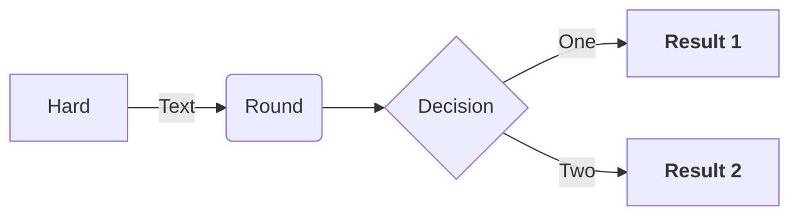
```mermaid
flowchart LR
  A[Hard] -->|Text| B(Round)
  B --> C{Decision}
  C -->|One| D["`**Result 1**`"]
  C -->|Two| E["`**Result 2**`"]
```

```
flowchart TD
  A[Hard] -->|Text| B(Round)
  B --> C{Decision}
  C -->|One| D["`**Result 1**`"]
  C -->|Two| E["`**Result 2**`"]
```

> Source: [https://mermaid.js.org/syntax/flowchart.html](https://mermaid.js.org/syntax/flowchart.html)

## Swimlane Diagram

```mermaid
swimlane-beta LR
  subgraph Customer
    request[Request service]
    receive[Receive update]
  end

  subgraph Support
    triage[Triage request]
    answer[Send answer]
  end

  subgraph Engineering
    investigate[Investigate issue]
    fix[Prepare fix]
  end

  request --> triage
  triage -->|Known issue| answer
  triage -->|Needs code change| investigate
  investigate --> fix --> answer
  answer --> receive
```

```
swimlane-beta LR
  subgraph Customer
    request[Request service]
    receive[Receive update]
  end

  subgraph Support
    triage[Triage request]
    answer[Send answer]
  end

  subgraph Engineering
    investigate[Investigate issue]
    fix[Prepare fix]
  end

  request --> triage
  triage -->|Known issue| answer
  triage -->|Needs code change| investigate
  investigate --> fix --> answer
  answer --> receive
```

> Source: [https://mermaid.js.org/syntax/swimlanes.html](https://mermaid.js.org/syntax/swimlanes.html)

## Sequence Diagram

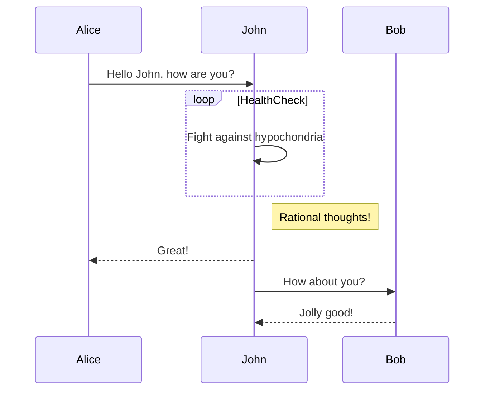
```mermaid
sequenceDiagram
  Alice->>John: Hello John, how are you?
  loop HealthCheck
    John->>John: Fight against hypochondria
  end
  Note right of John: Rational thoughts!
  John-->>Alice: Great!
  John->>Bob: How about you?
  Bob-->>John: Jolly good!
```

```
sequenceDiagram
  Alice->>John: Hello John, how are you?
  loop HealthCheck
    John->>John: Fight against hypochondria
  end
  Note right of John: Rational thoughts!
  John-->>Alice: Great!
  John->>Bob: How about you?
  Bob-->>John: Jolly good!
```

> Source: [https://mermaid.js.org/syntax/sequenceDiagram.html](https://mermaid.js.org/syntax/sequenceDiagram.html)

## Class Diagram

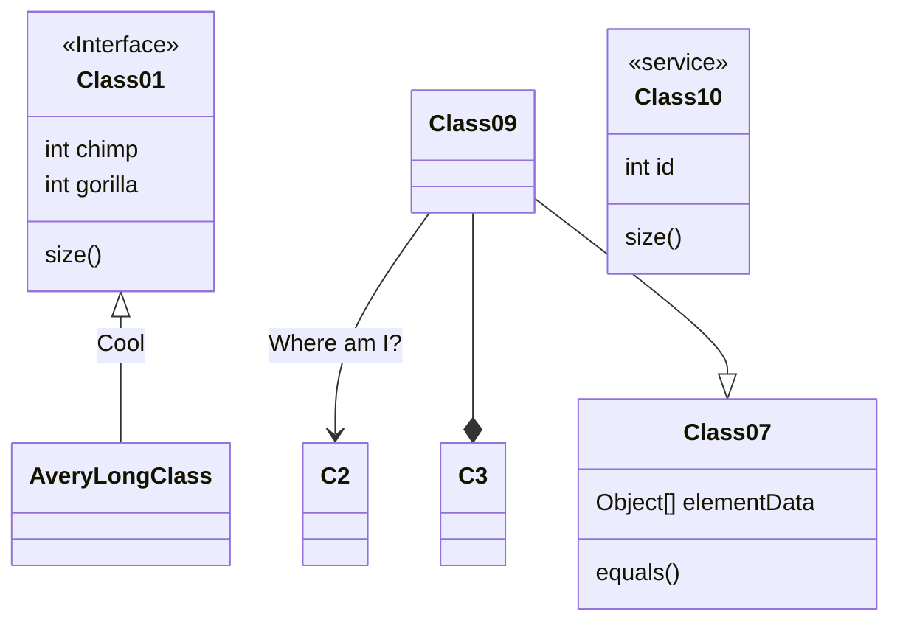
```mermaid
classDiagram
  Class01 <|-- AveryLongClass : Cool
  <<Interface>> Class01
  Class09 --> C2 : Where am I?
  Class09 --* C3
  Class09 --|> Class07
  Class07 : equals()
  Class07 : Object[] elementData
  Class01 : size()
  Class01 : int chimp
  Class01 : int gorilla
  class Class10 {
    <<service>>
    int id
    size()
  }
```

```
classDiagram
  Class01 <|-- AveryLongClass : Cool
  <<Interface>> Class01
  Class09 --> C2 : Where am I?
  Class09 --* C3
  Class09 --|> Class07
  Class07 : equals()
  Class07 : Object[] elementData
  Class01 : size()
  Class01 : int chimp
  Class01 : int gorilla
  class Class10 {
    <<service>>
    int id
    size()
  }
```

> Source: [https://mermaid.js.org/syntax/classDiagram.html](https://mermaid.js.org/syntax/classDiagram.html)

## State Diagram

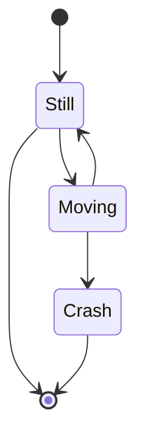
```mermaid
stateDiagram-v2
  [*]     --> Still
  Still   --> [*]
  Still   --> Moving
  Moving  --> Still
  Moving  --> Crash
  Crash   --> [*]
```

```
stateDiagram-v2
  [*]     --> Still
  Still   --> [*]
  Still   --> Moving
  Moving  --> Still
  Moving  --> Crash
  Crash   --> [*]
```

> Source: [https://mermaid.js.org/syntax/stateDiagram.html](https://mermaid.js.org/syntax/stateDiagram.html)


## Entity Relationship Diagram

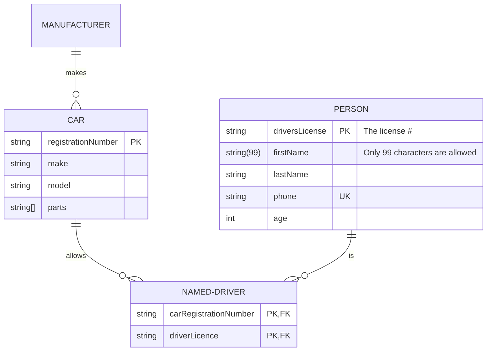
```mermaid
erDiagram
  CAR ||--o{ NAMED-DRIVER : allows
  CAR {
    string registrationNumber PK
    string make
    string model
    string[] parts
  }
  PERSON ||--o{ NAMED-DRIVER : is
  PERSON {
    string driversLicense PK "The license #"
    string(99) firstName "Only 99 characters are allowed"
    string lastName
    string phone UK
    int age
  }
  NAMED-DRIVER {
    string carRegistrationNumber PK, FK
    string driverLicence PK, FK
  }
  MANUFACTURER only one to zero or more CAR : makes
```

```
erDiagram
  CAR ||--o{ NAMED-DRIVER : allows
  CAR {
    string registrationNumber PK
    string make
    string model
    string[] parts
  }
  PERSON ||--o{ NAMED-DRIVER : is
  PERSON {
    string driversLicense PK "The license #"
    string(99) firstName "Only 99 characters are allowed"
    string lastName
    string phone UK
    int age
  }
  NAMED-DRIVER {
    string carRegistrationNumber PK, FK
    string driverLicence PK, FK
  }
  "**MANUFACTURER**" only one to zero or more CAR : makes
```

>Source: [https://mermaid.js.org/syntax/entityRelationshipDiagram.html](https://mermaid.js.org/syntax/entityRelationshipDiagram.html)

## User Journey Diagram

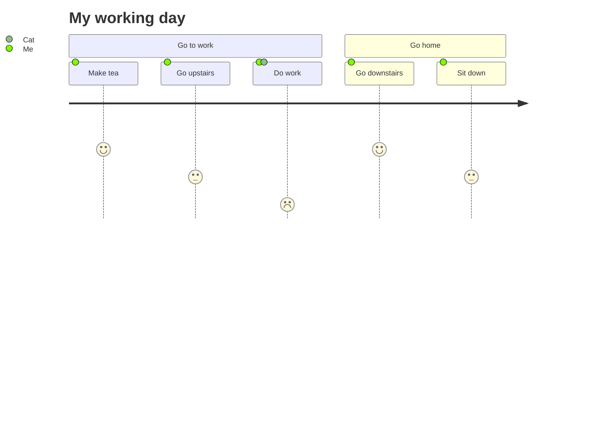
```mermaid
journey
  title My working day
  section Go to work
    Make tea      : 5: Me
    Go upstairs   : 3: Me
    Do work       : 1: Me, Cat
  section Go home
    Go downstairs : 5: Me
    Sit down      : 3: Me
```

```
journey
  title My working day
  section Go to work
    Make tea      : 5: Me
    Go upstairs   : 3: Me
    Do work       : 1: Me, Cat
  section Go home
    Go downstairs : 5: Me
    Sit down      : 3: Me
```

> Source: [https://mermaid.js.org/syntax/userJourney.html](https://mermaid.js.org/syntax/userJourney.html)

## Gantt Chart

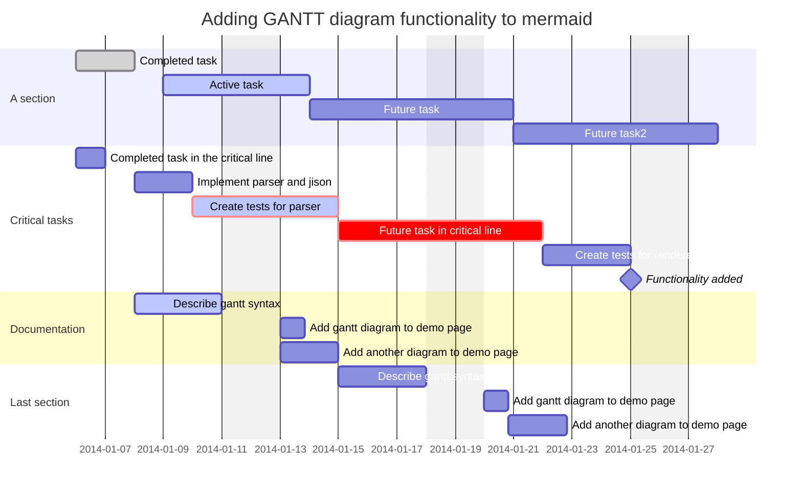
```mermaid
gantt
  dateFormat  YYYY-MM-DD
  title       Adding GANTT diagram functionality to mermaid
  excludes    weekends
  %% (`excludes` accepts specific dates in YYYY-MM-DD format, days of the week ("sunday") or "weekends", but not the word "weekdays".)

  section A section
  Completed task            :done,    des1, 2014-01-06,2014-01-08
  Active task               :active,  des2, 2014-01-09, 3d
  Future task               :         des3, after des2, 5d
  Future task2              :         des4, after des3, 5d

  section Critical tasks
  Completed task in the critical line :2014-01-06,24h
  Implement parser and jison          :after des1, 2d
  Create tests for parser             :crit, active, 3d
  Future task in critical line        :crit, 5d
  Create tests for renderer           :3d
  Functionality added                 :milestone, isadded, 2014-01-25, 0d

  section Documentation
  Describe gantt syntax               :active, a1, after des1, 3d
  Add gantt diagram to demo page      :after a1  , 20h
  Add another diagram to demo page    :doc1, after a1  , 48h

  section Last section
  Describe gantt syntax               :after doc1, 3d
  Add gantt diagram to demo page      :20h
  Add another diagram to demo page    :48h
```

```
gantt
  dateFormat  YYYY-MM-DD
  title       Adding GANTT diagram functionality to mermaid
  excludes    weekends
  %% (`excludes` accepts specific dates in YYYY-MM-DD format, days of the week ("sunday") or "weekends", but not the word "weekdays".)

  section A section
  Completed task            :done,    des1, 2014-01-06,2014-01-08
  Active task               :active,  des2, 2014-01-09, 3d
  Future task               :         des3, after des2, 5d
  Future task2              :         des4, after des3, 5d

  section Critical tasks
  Completed task in the critical line :2014-01-06,24h
  Implement parser and jison          :after des1, 2d
  Create tests for parser             :crit, active, 3d
  Future task in critical line        :crit, 5d
  Create tests for renderer           :3d
  Functionality added                 :milestone, isadded, 2014-01-25, 0d

  section Documentation
  Describe gantt syntax               :active, a1, after des1, 3d
  Add gantt diagram to demo page      :after a1  , 20h
  Add another diagram to demo page    :doc1, after a1  , 48h

  section Last section
  Describe gantt syntax               :after doc1, 3d
  Add gantt diagram to demo page      :20h
  Add another diagram to demo page    :48h
```

> Source: [https://mermaid.js.org/syntax/gantt.html](https://mermaid.js.org/syntax/gantt.html)

### Bar chart


```mermaid
gantt
  title Git Issues - days since last update
  dateFormat  X
  axisFormat %s

  section Issue19062
  71   : 0, 71
  section Issue19401
  36   : 0, 36
  section Issue193
  34   : 0, 34
  section Issue7441
  9    : 0, 9
  section Issue1300
  5    : 0, 5
```

```
gantt
  title Git Issues - days since last update
  dateFormat  X
  axisFormat %s

  section Issue19062
  71   : 0, 71
  section Issue19401
  36   : 0, 36
  section Issue193
  34   : 0, 34
  section Issue7441
  9    : 0, 9
  section Issue1300
  5    : 0, 5
```

> Note: *Bar chart using **gantt chart** documentation*

## Pie Chart

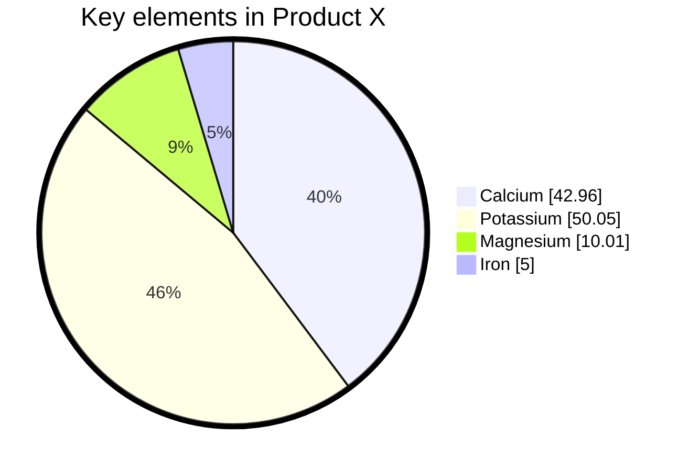
```mermaid
---
config:
  pie:
    textPosition: 0.5
    donutHole: 0.2
    highlightSlice: Potassium
  themeVariables:
    pieOuterStrokeWidth: "5px"
---
pie showData
  title Key elements in Product X
  "Calcium" : 42.96
  "Potassium" : 50.05
  "Magnesium" : 10.01
  "Iron" :  5
```

```
---
config:
  pie:
    textPosition: 0.5
    donutHole: 0.2
    highlightSlice: Potassium
  themeVariables:
    pieOuterStrokeWidth: "5px"
---
pie showData
  title Key elements in Product X
  "Calcium" : 42.96
  "Potassium" : 50.05
  "Magnesium" : 10.01
  "Iron" :  5
```

> Source: [https://mermaid.js.org/syntax/pie.html](https://mermaid.js.org/syntax/pie.html)

## Quadrant Chart

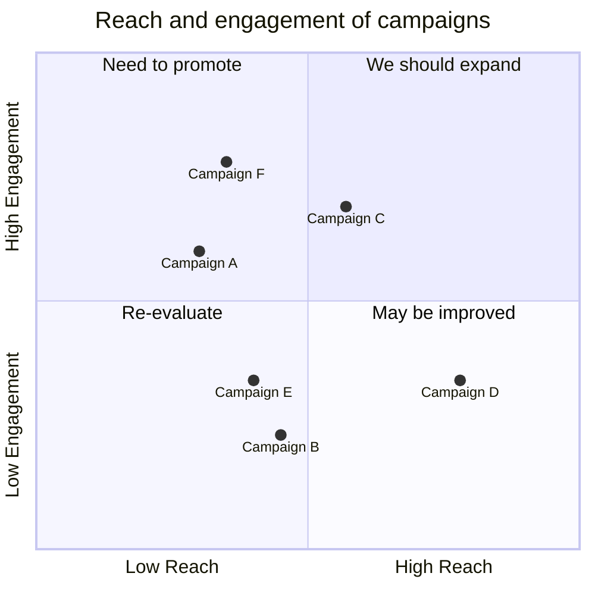
```mermaid
quadrantChart
  title Reach and engagement of campaigns
  x-axis Low Reach --> High Reach
  y-axis Low Engagement --> High Engagement
  quadrant-1 We should expand
  quadrant-2 Need to promote
  quadrant-3 Re-evaluate
  quadrant-4 May be improved
  Campaign A: [0.3, 0.6]
  Campaign B: [0.45, 0.23]
  Campaign C: [0.57, 0.69]
  Campaign D: [0.78, 0.34]
  Campaign E: [0.40, 0.34]
  Campaign F: [0.35, 0.78]
```

```
quadrantChart
  title Reach and engagement of campaigns
  x-axis Low Reach --> High Reach
  y-axis Low Engagement --> High Engagement
  quadrant-1 We should expand
  quadrant-2 Need to promote
  quadrant-3 Re-evaluate
  quadrant-4 May be improved
  Campaign A: [0.3, 0.6]
  Campaign B: [0.45, 0.23]
  Campaign C: [0.57, 0.69]
  Campaign D: [0.78, 0.34]
  Campaign E: [0.40, 0.34]
  Campaign F: [0.35, 0.78]
```

> Source: [https://mermaid.js.org/syntax/quadrantChart.html](https://mermaid.js.org/syntax/quadrantChart.html)

## Requirement Diagram

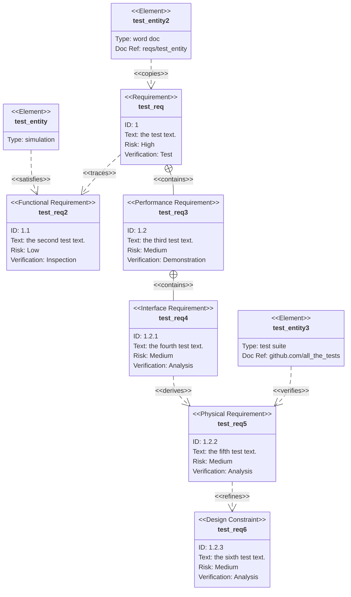
```mermaid
requirementDiagram

  requirement test_req {
    id: 1
    text: the test text.
    risk: high
    verifymethod: test
  }

  functionalRequirement test_req2 {
    id: 1.1
    text: the second test text.
    risk: low
    verifymethod: inspection
  }

  performanceRequirement test_req3 {
    id: 1.2
    text: the third test text.
    risk: medium
    verifymethod: demonstration
  }

  interfaceRequirement test_req4 {
    id: 1.2.1
    text: the fourth test text.
    risk: medium
    verifymethod: analysis
  }

  physicalRequirement test_req5 {
    id: 1.2.2
    text: the fifth test text.
    risk: medium
    verifymethod: analysis
  }

  designConstraint test_req6 {
    id: 1.2.3
    text: the sixth test text.
    risk: medium
    verifymethod: analysis
  }

  element test_entity {
    type: simulation
  }

  element test_entity2 {
    type: word doc
    docRef: reqs/test_entity
  }

  element test_entity3 {
    type: "test suite"
    docRef: github.com/all_the_tests
  }

  test_entity - satisfies -> test_req2
  test_req - traces -> test_req2
  test_req - contains -> test_req3
  test_req3 - contains -> test_req4
  test_req4 - derives -> test_req5
  test_req5 - refines -> test_req6
  test_entity3 - verifies -> test_req5
  test_req <- copies - test_entity2
```

```
requirementDiagram

  requirement test_req {
    id: 1
    text: the test text.
    risk: high
    verifymethod: test
  }

  functionalRequirement test_req2 {
    id: 1.1
    text: the second test text.
    risk: low
    verifymethod: inspection
  }

  performanceRequirement test_req3 {
    id: 1.2
    text: the third test text.
    risk: medium
    verifymethod: demonstration
  }

  interfaceRequirement test_req4 {
    id: 1.2.1
    text: the fourth test text.
    risk: medium
    verifymethod: analysis
  }

  physicalRequirement test_req5 {
    id: 1.2.2
    text: the fifth test text.
    risk: medium
    verifymethod: analysis
  }

  designConstraint test_req6 {
    id: 1.2.3
    text: the sixth test text.
    risk: medium
    verifymethod: analysis
  }

  element test_entity {
    type: simulation
  }

  element test_entity2 {
    type: word doc
    docRef: reqs/test_entity
  }

  element test_entity3 {
    type: "test suite"
    docRef: github.com/all_the_tests
  }

  test_entity - satisfies -> test_req2
  test_req - traces -> test_req2
  test_req - contains -> test_req3
  test_req3 - contains -> test_req4
  test_req4 - derives -> test_req5
  test_req5 - refines -> test_req6
  test_entity3 - verifies -> test_req5
  test_req <- copies - test_entity2
```

> Source: [https://mermaid.js.org/syntax/requirementDiagram.html](https://mermaid.js.org/syntax/requirementDiagram.html)

## Git Graph

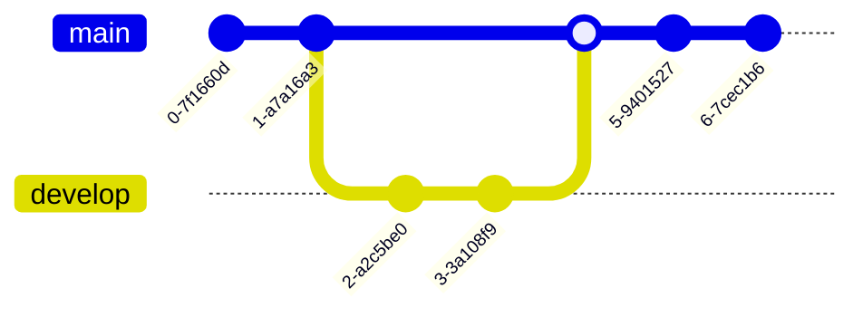
```mermaid
gitGraph
  commit
  commit
  branch develop
  checkout develop
  commit
  commit
  checkout main
  merge develop
  commit
  commit
```

```
gitGraph
  commit
  commit
  branch develop
  checkout develop
  commit
  commit
  checkout main
  merge develop
  commit
  commit
```

> Source: [https://mermaid.js.org/syntax/gitgraph.html](https://mermaid.js.org/syntax/gitgraph.html)

## C4 Diagram

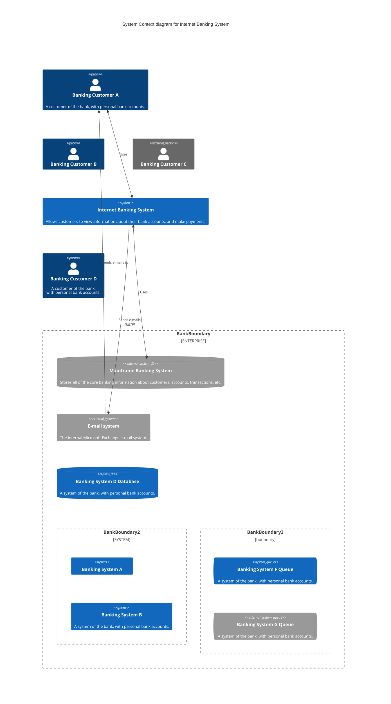
```mermaid
C4Context
  title System Context diagram for Internet Banking System

  Person(customerA, "Banking Customer A", "A customer of the bank, with personal bank accounts.")
  Person(customerB, "Banking Customer B")
  Person_Ext(customerC, "Banking Customer C")
  System(SystemAA, "Internet Banking System", "Allows customers to view information about their bank accounts, and make payments.")

  Person(customerD, "Banking Customer D", "A customer of the bank, <br/> with personal bank accounts.")

  Enterprise_Boundary(b1, "BankBoundary") {

    SystemDb_Ext(SystemE, "Mainframe Banking System", "Stores all of the core banking information about customers, accounts, transactions, etc.")

    System_Boundary(b2, "BankBoundary2") {
      System(SystemA, "Banking System A")
      System(SystemB, "Banking System B", "A system of the bank, with personal bank accounts.")
    }

    System_Ext(SystemC, "E-mail system", "The internal Microsoft Exchange e-mail system.")
    SystemDb(SystemD, "Banking System D Database", "A system of the bank, with personal bank accounts.")

    Boundary(b3, "BankBoundary3", "boundary") {
      SystemQueue(SystemF, "Banking System F Queue", "A system of the bank, with personal bank accounts.")
      SystemQueue_Ext(SystemG, "Banking System G Queue", "A system of the bank, with personal bank accounts.")
    }
  }

  BiRel(customerA, SystemAA, "Uses")
  BiRel(SystemAA, SystemE, "Uses")
  Rel(SystemAA, SystemC, "Sends e-mails", "SMTP")
  Rel(SystemC, customerA, "Sends e-mails to")
```

```
C4Context
  title System Context diagram for Internet Banking System

  Person(customerA, "Banking Customer A", "A customer of the bank, with personal bank accounts.")
  Person(customerB, "Banking Customer B")
  Person_Ext(customerC, "Banking Customer C")
  System(SystemAA, "Internet Banking System", "Allows customers to view information about their bank accounts, and make payments.")

  Person(customerD, "Banking Customer D", "A customer of the bank, <br/> with personal bank accounts.")

  Enterprise_Boundary(b1, "BankBoundary") {

    SystemDb_Ext(SystemE, "Mainframe Banking System", "Stores all of the core banking information about customers, accounts, transactions, etc.")

    System_Boundary(b2, "BankBoundary2") {
      System(SystemA, "Banking System A")
      System(SystemB, "Banking System B", "A system of the bank, with personal bank accounts.")
    }

    System_Ext(SystemC, "E-mail system", "The internal Microsoft Exchange e-mail system.")
    SystemDb(SystemD, "Banking System D Database", "A system of the bank, with personal bank accounts.")

    Boundary(b3, "BankBoundary3", "boundary") {
      SystemQueue(SystemF, "Banking System F Queue", "A system of the bank, with personal bank accounts.")
      SystemQueue_Ext(SystemG, "Banking System G Queue", "A system of the bank, with personal bank accounts.")
    }
  }

  BiRel(customerA, SystemAA, "Uses")
  BiRel(SystemAA, SystemE, "Uses")
  Rel(SystemAA, SystemC, "Sends e-mails", "SMTP")
  Rel(SystemC, customerA, "Sends e-mails to")
```

> Note: *C4 is on experimental*

> Source: [https://mermaid.js.org/syntax/c4.html](https://mermaid.js.org/syntax/c4.html)

## Mindmap

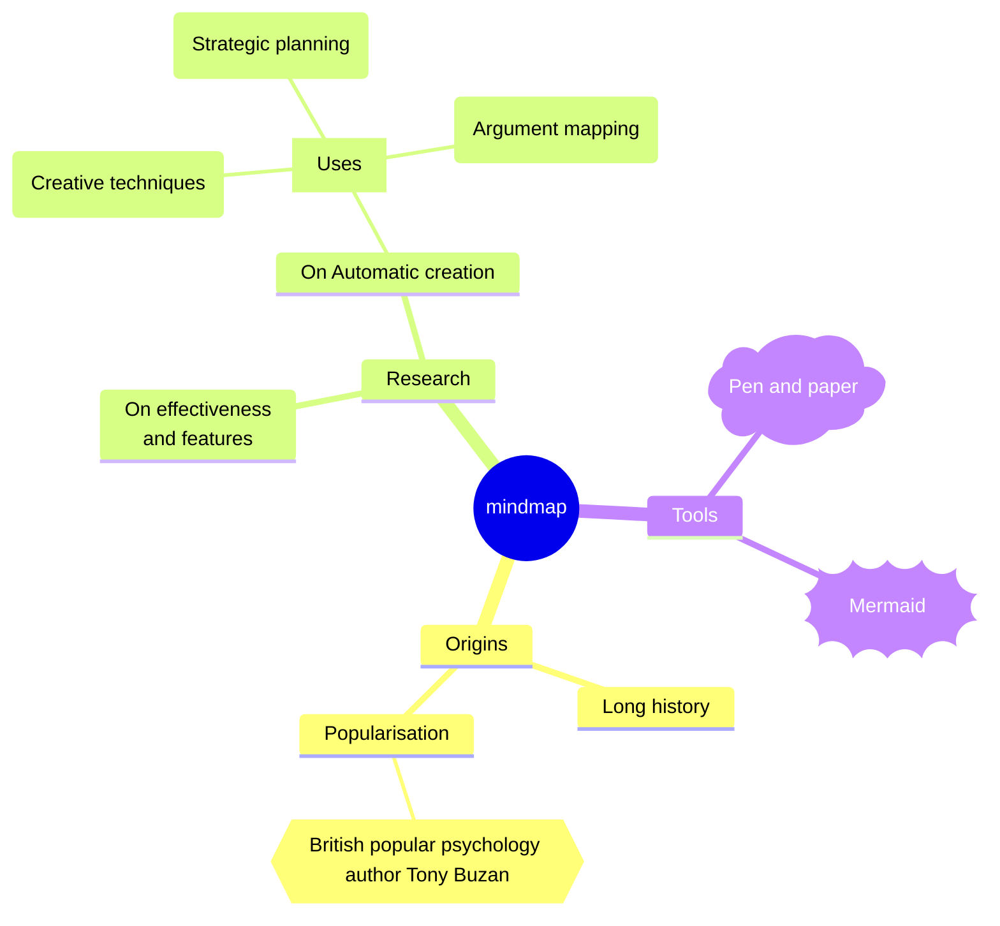
```mermaid
mindmap
  root((mindmap))
    Origins
      Long history
      ::icon(fa fa-book)
      Popularisation
        {{British popular psychology author Tony Buzan}}
    Research
      On effectiveness<br/>and features
      On Automatic creation
        [Uses]
          (Creative techniques)
          (Strategic planning)
          (Argument mapping)
    Tools
      )Pen and paper(
      ))Mermaid((
```

```
mindmap
  root((mindmap))
    Origins
      Long history
      ::icon(fa fa-book)
      Popularisation
        {{British popular psychology author Tony Buzan}}
    Research
      On effectiveness<br/>and features
      On Automatic creation
        [Uses]
          (Creative techniques)
          (Strategic planning)
          (Argument mapping)
    Tools
      )Pen and paper(
      ))Mermaid((
```

> Source: [https://mermaid.js.org/syntax/mindmap.html](https://mermaid.js.org/syntax/mindmap.html)